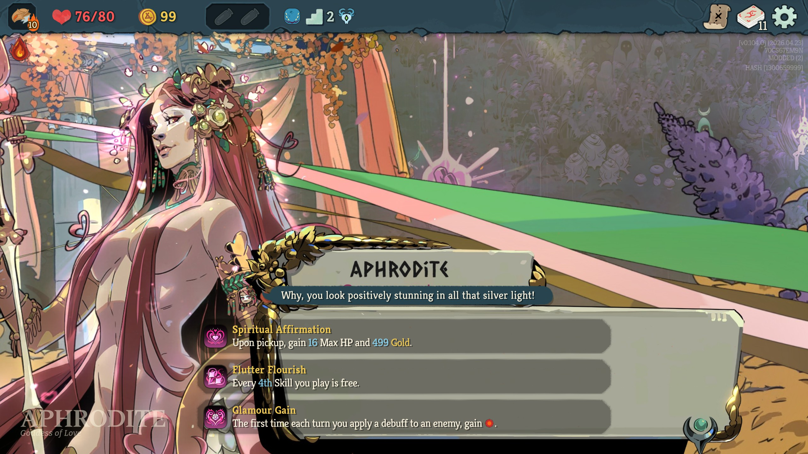
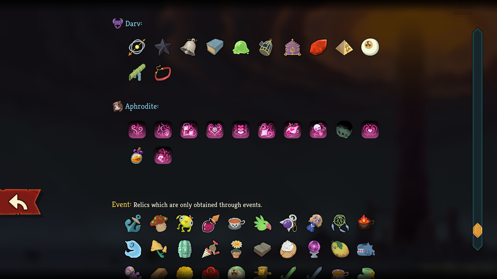

# Aphrodite Ancient

## 📄 Description

This mod introduces a new Ancient, **Aphrodite** from the hit game Hades 2, who can appear in Act 3 and offers a selection of Relics that focus on: Weak, Charm, debuffs, healing, dealing more Attack damage and other things.

## 🌐 Localization
The mod is available in:
- English

## 📦 Dependencies
- BaseLib version 3.1.2 or newer.

## ⚙️ Installation
1. Go to the [Releases](https://github.com/JohnnyBazooka89/StS2ModAphroditeAncient/releases) page on GitHub and download the latest version.
2. Extract the ZIP file.
3. Navigate to your *Slay the Spire 2* installation folder: `{SteamLibrary}\steamapps\common\Slay The Spire 2`
4. If the `mods` folder does not exist, create it.
5. Move the `AphroditeAncient` folder into the `mods` folder.

## 🖼️ Screenshots

## 🤝 Contact
If you run into any issues or have suggestions for balance changes, feel free to reach out on the official Slay the Spire 2 Discord (nickname: JohnnyBazooka89).